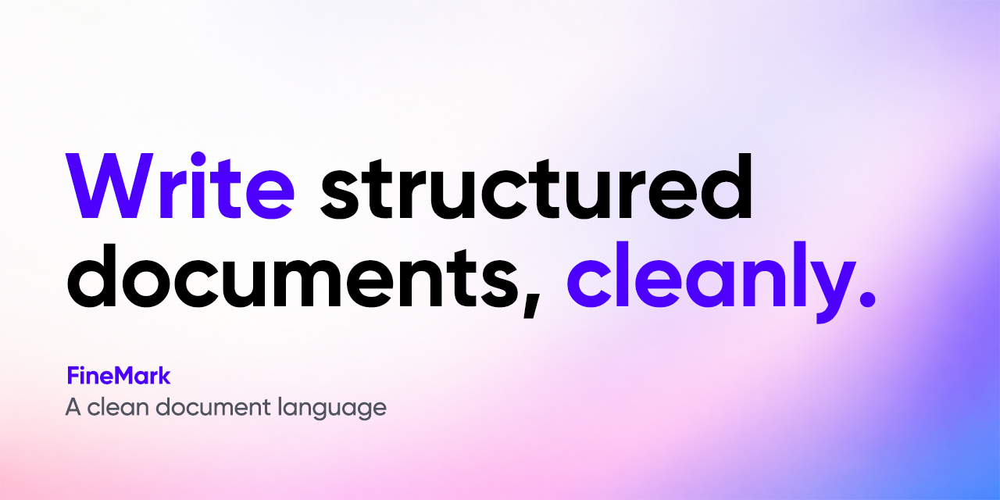

  

FineMark is a clean markup language for structured documents.

  
  

  <a href="https://github.com/FineMark/finemark">Repository</a>
  · <a href="https://github.com/FineMark/finemark/issues">Bug reports</a>
  · <a href="https://github.com/FineMark/finemark/discussions">Discussions</a>

## Contributors

Thanks to everyone who has contributed to FineMark.

## Star History

## License

FineMark is licensed under either of

- Apache License, Version 2.0
  ([LICENSE-APACHE](LICENSE-APACHE) or https://www.apache.org/licenses/LICENSE-2.0)
- MIT license
  ([LICENSE-MIT](LICENSE-MIT) or https://opensource.org/licenses/MIT)

at your option.